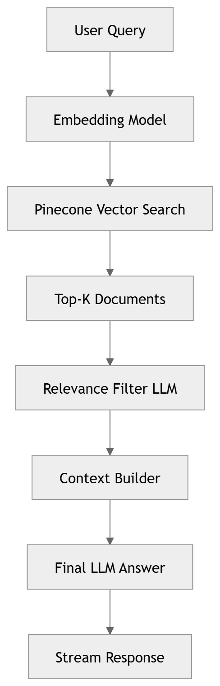
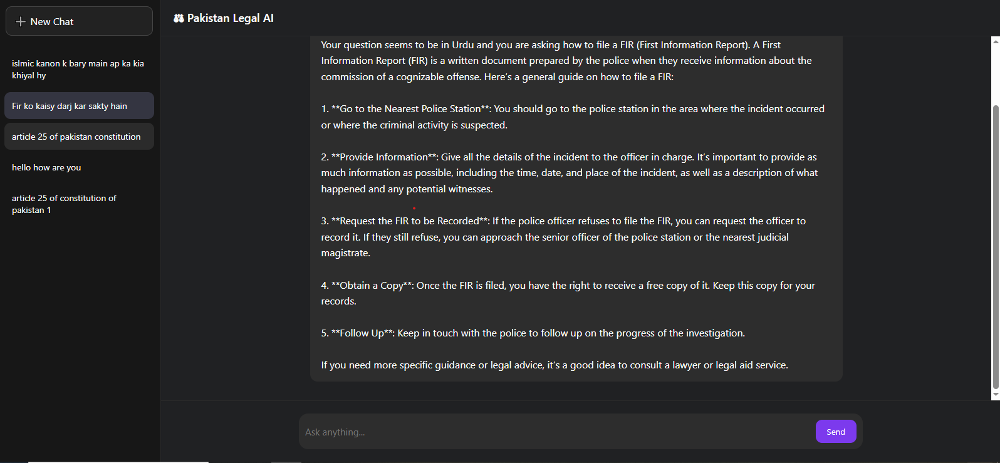

# 🧠 AI-Powered Constitutional Law Chatbot for Pakistan

**AI-Powered Constitutional Law Chatbot for Pakistan** is an advanced, multilingual chat application that enables users to interact with the **Constitution of Pakistan (1973)**—including its **Articles, Schedules, and Amendments**—in natural language.  

🚀 Now enhanced with **Self-RAG (Self-Reflective Retrieval-Augmented Generation)**, the chatbot not only retrieves relevant constitutional content but also evaluates and refines its own responses to ensure higher accuracy, grounding, and reliability.

Built using a **Self-RAG pipeline**, this chatbot provides **source-grounded, self-verified answers** backed by actual constitutional text, with real-time streaming and persistent conversational memory.

---

## 🚀 Project Overview

This project is part of the **Final Year Project (FYP)** for the **Bachelor of Science in Software Engineering** at **The Islamia University of Bahawalpur**, supervised by **Dr. Nadia Khan**.

The core idea is to leverage cutting-edge AI technology to make constitutional knowledge accessible and understandable to:

- **Law Students**
- **Lawyers**
- **General Public**
- **Researchers**

It supports **multilingual interaction** including:
🌐 English, Urdu, French, and Arabic.

---

## 📌 Features

### 🔹 Self-RAG Powered Legal Intelligence (NEW 🚀)

Instead of relying solely on traditional RAG, the system now implements **Self-RAG**, which adds a reflection and verification layer to the retrieval pipeline.

Key Improvements:

- ✅ **Self-Reflection Mechanism** – The model evaluates whether retrieved context is sufficient.
- ✅ **Answer Verification Step** – Ensures responses are grounded strictly in constitutional text.
- ✅ **Hallucination Reduction** – Minimizes unsupported or fabricated information.
- ✅ **Adaptive Retrieval** – If context is weak, the system re-triggers retrieval before answering.
- ✅ **Confidence-Aware Responses** – The system prioritizes factual grounding over speculation.

This makes the chatbot significantly more reliable for sensitive legal queries.

---


### 🔹 AI-Driven Knowledge Retrieval

- Uses **Self-Reflective Retrieval-Augmented Generation (Self-RAG)**.
- Embedding generation and semantic search using **HuggingFace Sentence Transformers**.
- Vector store powered by **Pinecone** for high-quality similarity matching.
- Reflection and validation prompts ensure constitutional grounding.

---

### 🔹 Multilingual Support

Query and response support for:

- 🇬🇧 English  
- 🇵🇰 Urdu  
- 🇫🇷 French  
- 🇸🇦 Arabic  

---

### 🔹 Real-Time Streaming

- FastAPI backend with **WebSocket support** for streaming answers as they are generated.

---

### 🔹 Persistent Memory & Chat History

- **Long-term conversational memory** for each registered user.
- Users can **view or delete their chat history**.
- Memory saves context to improve future responses.
- Reflection-aware memory ensures past context does not override constitutional grounding.

---

### 🔹 Authentication & Access Control

User roles:

- 👤 **Guest**
- ✅ **Registered User**
- 🛠 **Admin**

Admin dashboard includes system monitoring and logs access.

---

### 🔹 Observability & Monitoring

- Integrated with **LangSmith** for trace and observability management.
- Reflection traces allow monitoring of:
  - Retrieval quality
  - Re-ranking behavior
  - Self-verification decisions

---

### 🔹 Legal Safety & Disclaimer

- All answers are **informational only**, not legal advice.
- Responses are grounded directly in constitutional text with source traceability.
- Self-RAG verification layer ensures strict adherence to source material.

---



## 🛠️ Tech Stack

| Layer | Technology |
|-------|------------|
| Backend | FastAPI |
| Frontend | HTML/CSS/JavaScript |
| Real-Time | WebSockets |
| Retrieval Pipeline | Self-RAG Architecture |
| Vector Database | Pinecone |
| Embeddings | HuggingFace Sentence Transformers |
| LLM Integration | OpenAI (Qwen 72B model) |
| Persistence DB | PostgreSQL (chat + memory) |
| Auth DB | MySQL (user accounts) |
| Monitoring | LangSmith |
| Deployment | Docker |

---

## 📁 Repository Structure

```bash
constitutional_chatbot/
│
├── src/
│   ├── __init__.py
│   └── helper.py             # Self-RAG agent creation
│
├── research/
│   └── trials.py             # Self-RAG experiments & Jupyter notebooks
│
├── src/
│   └── prompt.py             # System & reflection prompts
│
├── data/
│   └── constitutional.pdf    # Knowledge base
│
├── static/                   # Frontend assets
├── templates/                # HTML templates
│
├── app.py                    # FastAPI application                  
├── Dockerfile                # Docker file
├── setup.py                  
├── template.sh               # Text chunking
├── vector_store.py           # Pinecone integration
├── store_index.py            # Embedding model
├── requirements.txt          # Python dependencies
├── .env                      # Environment variables
└── README.md                 # This file
```

## 🧠 How It Works (Self-RAG Pipeline)

### 1️⃣ Document Processing

- PDFs of the Constitution are cleaned and split using a **recursive text splitter**.
- Text chunks are embedded and stored in **Pinecone**.

---

### 2️⃣ Initial Retrieval

- User query sent to **FastAPI** backend via **WebSocket**.
- Query embedding generated.
- Semantic similarity search retrieves **top-k constitutional chunks**.

---

### 3️⃣ Self-Reflection Phase (NEW 🚀)

The system evaluates:

- Is the retrieved context sufficient?
- Is more retrieval required?
- Are sources properly aligned with the question?

If needed, the system:

- Re-triggers retrieval  
- Re-ranks chunks  
- Expands search scope  

---

### 4️⃣ Grounded Answer Generation

- The LLM generates an answer strictly grounded in retrieved text.

Reflection prompt checks:

- Factual alignment  
- Source coverage  
- Unsupported claims  

---

### 5️⃣ Real-Time Streaming & Memory Storage

- Backend streams answers through **WebSockets**.
- Conversations saved in **PostgreSQL**.
- Memory used responsibly without overriding constitutional truth.

---

# 🧪 Setup & Installation

## 1️⃣ Clone the Repository

```bash
git clone https://github.com/aliahmad552/constitutional-law-chatbot.git
cd constitutional-law-chatbot
```

### 2️⃣ Create & Activate Virtual Environment
```bash
python -m venv venv
```
source venv/bin/activate
### 3️⃣ Install Dependencies
```bash
pip install -r requirements.txt
```
### 4️⃣ Environment Setup

Copy .env.example to .env and configure:
```bash
OPENAI_API_KEY=your_openai_key
PINECONE_API_KEY=your_pinecone_key
MY_SQL_URL=your_mysql_connection
POSTGRES_URL=your_postgresql_connection
LANGSMITH_KEY=your_langsmith_key
```
### 5️⃣ Build Vector Index
```bash
python store_index.py
```
### 6️⃣ Run the Backend
```bash
uvicorn app:app --reload
```
### 7️⃣ Open the Frontend

Open in browser:
```bash
http://localhost:8000
```
## 🚧 Admin Dashboard

Admins can:

- Review logs

- Observe AI traces

- Monitor usage metrics

- Analyze Self-RAG reflection behavior

👤 Admin access requires set credentials in MySQL.

## 📜 Disclaimer

⚖️ This chatbot provides educational and informational information only.
It does not replace professional legal advice and should not be used when legal judgment is required.

While Self-RAG significantly reduces hallucinations and improves grounding, users must verify critical legal matters with qualified professionals.

## 🧾 Related Work

There are similar AI legal assistants worldwide, including:

- LawGPT: An AI model designed to answer legal questions in the context of Pakistani law.

## ❤️ Contributing

Contributions are welcome!

You can:

- Raise issues

- Submit pull requests

- Suggest improvements to the Self-RAG pipeline

- Improve multilingual performance

- Enhance reflection prompts

## 📄 License

This project is licensed under the Apache-2.0 License.

## 👨‍💻 Author

Ali Ahmad

- GitHub: https://github.com/aliahmad552

- LinkedIn: https://www.linkedin.com/in/ali-ahmad-dawana

- Email: aliahmaddawana@gmail.com